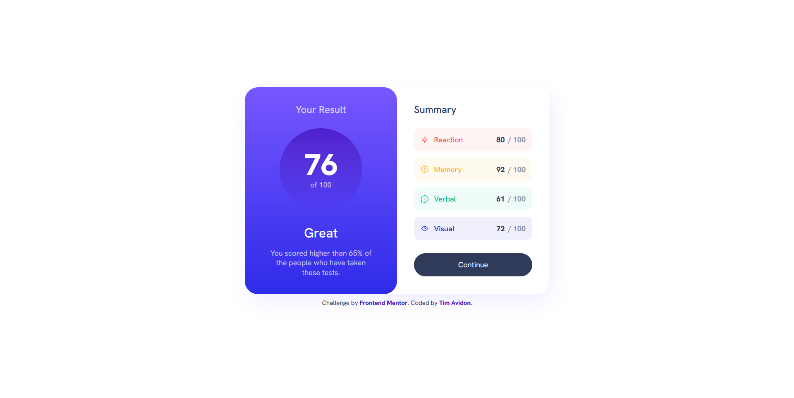

# Frontend Mentor - Results summary component solution

This is a solution to the [Results summary component challenge on Frontend Mentor](https://www.frontendmentor.io/challenges/results-summary-component-CE_K6s0maV). Frontend Mentor challenges help you improve your coding skills by building realistic projects. 

## Table of contents

- [Overview](#overview)
  - [The challenge](#the-challenge)
  - [Screenshot](#screenshot)
  - [Links](#links)
- [My process](#my-process)
  - [Built with](#built-with)
  - [Continued development](#continued-development)

## Overview

### The challenge

### Screenshot

### Links

- Solution URL: [Github](https://github.com/timavidon/frontend-mentor-c2)
- Live Site URL: [Live Site](https://timavidon.github.io/frontend-mentor-c2/)

## My process

### Built with

- HTML
- CSS
- Flexbox
- Font: [Hanken Grotesk](https://fonts.google.com/specimen/Hanken+Grotesk)

### Continued development

To improve the responsive design and to improve my overall skills.
learn to the best practices.
